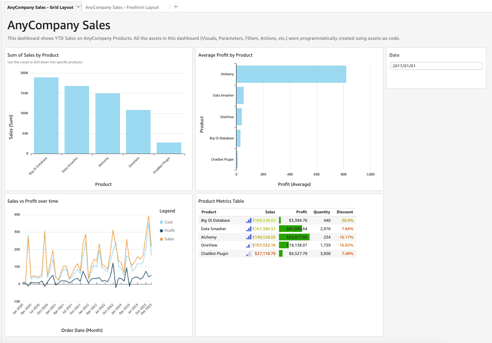

# QuickSight Assets-as-Code

## Overview
Amazon QuickSight "Assets-as-Code" allows BI users to treat QuickSight resources as code assets that can be managed outside of the QuickSight platform. This unlocks a number of capabilities for new and existing QuickSight users, including use cases like programmatic dashboard creation, version control & CI/CD pipelines, BI workload migration and more.

Currently, these APIs (*DescribeAnalysisDefinition, DescribeTemplateDefinition, DescribeDashboardDefinition*) allow developers to manage all supported charts and visual components in JSON format. With the defined JSON format, users can call the create/update APIs (*CreateAnalysis, UpdateAnalysis, CreateDashboard, UpdateDashboard*) to create or update QuickSight resources using the JSON format.

**With complex dashboards containing many resources, however, navigating through nested JSON code can be difficult to maintain. This code sample takes Assets-as-Code to the next level and demonstrates a way to declare dashboard resources (sheets, visuals, parameters, etc) as intuitive Python code.**

*Disclaimer: This code sample is not exhaustive and does not support all QuickSight resources and visual types. The purpose of this sample is to demonstrate the possibilities you can unlock using assets-as-code.*
## Example

### Output

The Analysis seen below was programmatically created without touching the QuickSight console. It contains features like bar charts, line charts, tables, conditional formatting, filters, and parameters.



### Visuals
To create a new Line Chart object, you can simply call the below line of code.
```
linechart_1 = LineChartVisual(visual_id = 'linechart1')
```
You can also configure additional settings by calling class-specific functions, such as adding a field or a title to a visual.
```
linechart_1.set_type('LINE')

linechart_1.add_date_dimension_field('Order Date','SaaS-Sales.csv', date_granularity = "MONTH")
```

### Sheets
Similarly, you can create sheets inside your analysis and set configurations like sheet title and layout type.
```
sheet_1 = Sheet('sheet1', name = "AnyCompany Sales")
sheet_1.set_title("AnyCompany Sales")
sheet_1.set_grid_layout("FIXED", "1600px")
```
You can add objects to your sheet, and even specify the size and position of your visuals.
```
sheet_1.add_grid_layout_element(linechart_1, 13, 10, 0, 10)
sheet_1.add_grid_layout_element(table_1, 13, 10, 13, 10)
sheet_1.add_grid_layout_element(parameter_date_control_1, 7, 3, 26, 0)
```
Once you are done defining your resources, the code sample will package all of your resources into a single JSON object accepted by QuickSight. Essentially, you can do anything you would do inside the QuickSight console - but instead of dragging and dropping, you can declare each step as code...pretty cool!
## How it works

The repo contains three main constructs - 1) **quicksight_assets_class.py**, 2) **create_analysis.py**, and 3) **asset_definition.json**.

1. **quicksight_assets_class.py**
    - This is the python code that wraps QuickSight JSON objects into Python Classes.
    - Each class will have functions that allow users to customize the JSON object (ex: adding a title to a visual, setting a default value for a parameter, etc.).
2. **create_analysis.py**
    - This is the code that declares dashboard objects in Python.
    - This code can be run in the AWS CLI or in an AWS Lambda function.
    - IMPORTANT: You will have to replace placeholder values with your own AWS Account ID and Dataset ARN.
        - Your AWS Account ID can be found from the top right corner of your AWS Console.
        - The 'SaaS-Sales.csv' dataset can be found on this [workshop link](https://catalog.workshops.aws/quicksight/en-US/author-workshop). 
            - Download it to your local machine and create a new QuickSight Dataset from it. 
            - You can extract the ARN of this dataset from its URL structure (https://aws-region.quicksight.aws.amazon.com/sn/data-sets/*dataset-arn*/view).
3. **asset_definition.json** (required only if running code through the CLI)
    - This is the output file generated by running create_analysis.py from the previous step.
    - This JSON file will be used to call the create-analysis or update-analysis API through the CLI.

### Architecture


*Note: While this is a fairly simple architecture in itself, the concept can be extended to sophisticated architectures involving CI/CD pipelines.*
### Calling the function using AWS CLI

To call the function using AWS CLI, we first want to run the create_analysis.py file to generate the assets_definition.json file.

```
python create_analysis.py
```

Then, you can call the API using the AWS CLI as noted below.
```
aws quicksight update-analysis --cli-input-json file://asset-definition.json --region us-east-1 --profile [your-aws-profile-here]
```
This should create/update your analysis.
### Calling the function using AWS Lambda

If you would like to run this code in Lambda, you can package the quicksight_assets_class.py into a Python package and use it inside your function using Lambda Layers.

First, place to quicksight_assets_class.py file into a folder named /python.

Then, zip the folder containing the assets file.
```
zip -r python_libs.zip ./python
```
Next, upload to zipped file to Lambda Layers and attach the layer to your Lambda function. This should allow you to import the code package directly from your function as seen below.
```
from quicksight_assets_class import *
```
Once you run the Lambda function, it should create/update your analysis.

*Note: Since assets-as-code is a relatively new feature, it may not be supported in the current Boto3 version inside Lambda. If this is the case, you will also need to add the latest version of Boto3 to your Lambda function to make it work.*
## Security

See [CONTRIBUTING](CONTRIBUTING.md#security-issue-notifications) for more information.

## License

This library is licensed under the MIT-0 License. See the LICENSE file.

