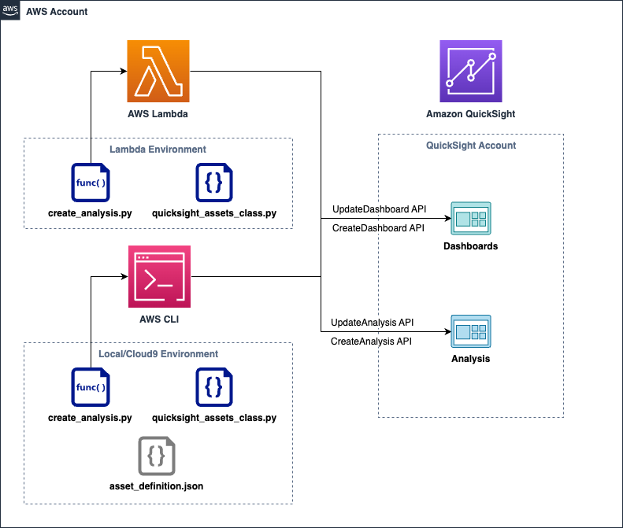

# QuickSight Assets-as-Code

## Overview
Amazon QuickSight "Assets-as-Code" allow customers and partners to treat BI resources as code assets that can be managed outside of the QuickSight platform. This unlocks a number of capabilities for new and existing QuickSight users, including but not limited to use cases such as programmatic dashboard creation, version control & CI/CD pipelines, BI workload migration, and much more.

Currently, these APIs (*DescribeAnalysisDefinition, DescribeTemplateDefinition, DescribeDashboardDefinition*) allow developers to manage all supported charts and visual components in JSON format. With the defined JSON format, users can call the create/update APIs (*CreateAnalysis, UpdateAnalysis, CreateDashboard, UpdateDashboard*) to create or update QuickSight resources.

With complex dashboards with many resources, however, navigating through nested JSON code can be difficult to maintain. This code sample takes Assets-as-Code to the next level and demonstrates way to define dashboard resources as intuitive Python code.

*Note: This code sample is not complete and does not contain an exhaustive list of all QuickSight resources and visual types. The main purpose is to demonstrate the possibilities you can unlock using assets-as-code.*
## Example

### Visuals
For example, to create a new Line Chart object, you can simply call the below line of code.
```
linechart_1 = LineChartVisual(visual_id = 'linechart1')
```
You can also configure additional settings by calling class-specific functions, such as adding a field or a title to a visual.
```
linechart_1.set_type('LINE')

linechart_1.add_date_dimension_field('Order Date','SaaS-Sales.csv', date_granularity = "MONTH")
```

### Sheets
Similarly, you can create sheets inside your analysis and set configurations like sheet title and layout type.
```
sheet_1 = Sheet('sheet1', name = "AnyCompany Sales")
sheet_1.set_title("AnyCompany Sales")
sheet_1.set_grid_layout("FIXED", "1600px")
```
You can add objects to your sheet, and even specify the size position of your visuals.
```
sheet_1.add_grid_layout_element(linechart_1, 13, 10, 0, 10)
sheet_1.add_grid_layout_element(table_1, 13, 10, 13, 10)
sheet_1.add_grid_layout_element(parameter_date_control_1, 7, 3, 26, 0)
```
Once you are done defining your resources, the code sample will package all of your resources into a single JSON object accepted by QuickSight.
## How it works

The repo contains three main constructs - 1) **quicksight_assets_class.py**, 2) **create_analysis.py**, and 3) **asset_definition.json**.

1. **quicksight_assets_class.py**
    - This is the python code that wraps QuickSight JSON objects into Python Classes.
2. **create_analysis.py**
    - This is the part where you define dashboard objects you want to create, including parameters, calculated fields, visuals, etc.
    - This code can be run in the AWS CLI or in a AWS Lambda function.
3. **asset_definition.json**
    - This file is generated by running create_analysis.py from the previous step.
    - This is the JSON file that will be used in the create-analysis or update-analysis APIs.

### Architecture


### Calling the function using AWS CLI

You can call the API using the AWS CLI as noted below.
```
aws quicksight update-analysis --cli-input-json file://asset-definition.json --region us-east-1 --profile [your-aws-profile-here]
```
### Calling the function using AWS Lambda

If you would like to run this code in Lambda, you can package the quicksight_assets_class.py into a Python package and use it inside your function using Lambda Layers.

First, place to quicksight_assets_class.py file into a folder named /python.

Then, zip the folder containing the assets file.
```
zip -r python_libs.zip ./python
```
Next, upload to zipped file to Lambda Layers and attach the layer to your Lambda function. This should allow you to import the code package directly from your function as seen below.
```
from quicksight_assets_class import *
```

*Note: Since assets-as-code is a relatively new feature, it may not be supported in the current Boto3 version inside Lambda. If this is the case, you will also need to add the latest version of Boto3 to your Lambda function to make it work.*
## Security

See [CONTRIBUTING](CONTRIBUTING.md#security-issue-notifications) for more information.

## License

This library is licensed under the MIT-0 License. See the LICENSE file.

